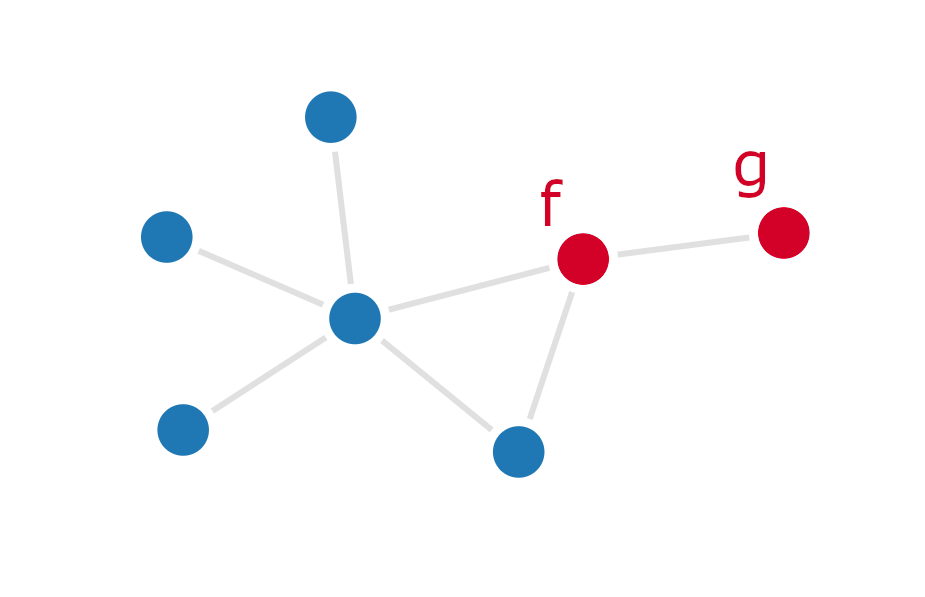
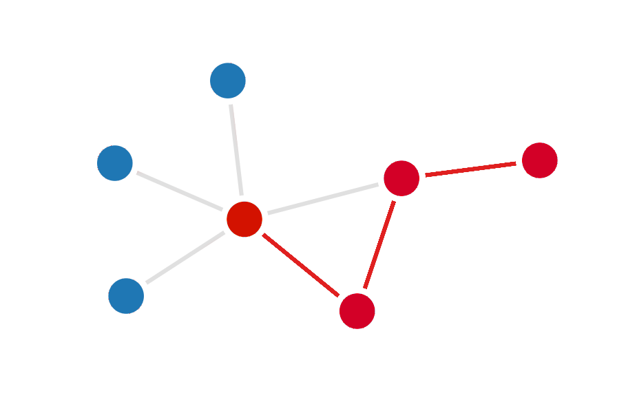
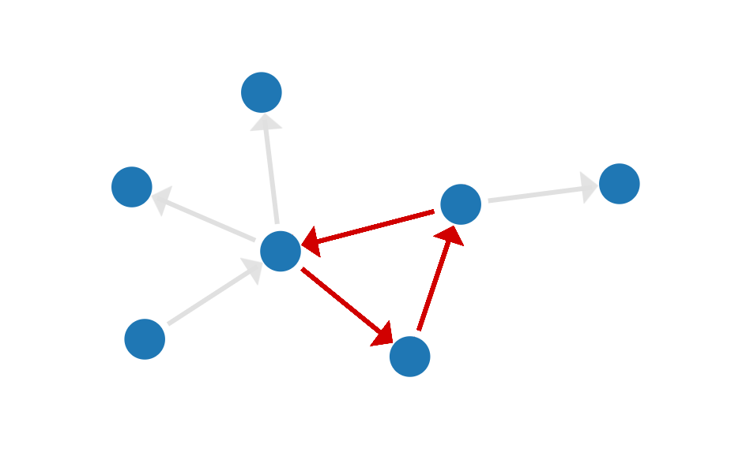
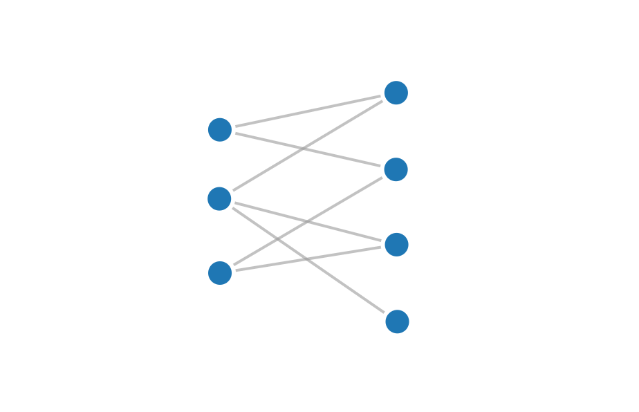
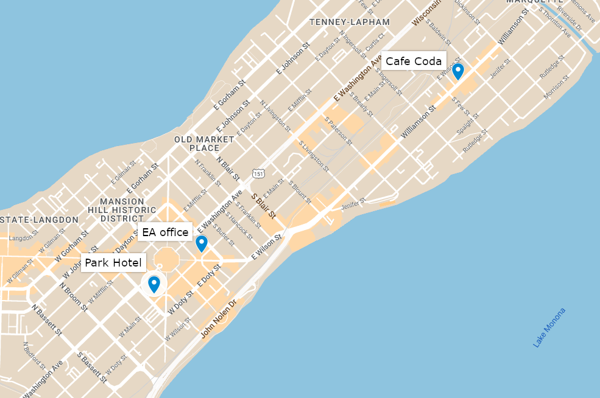
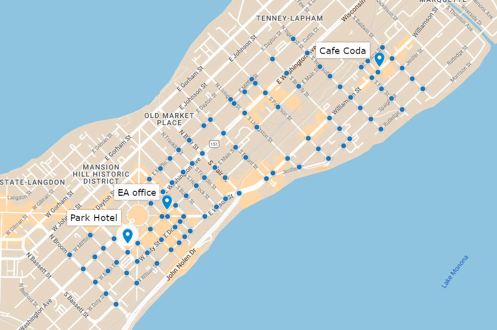
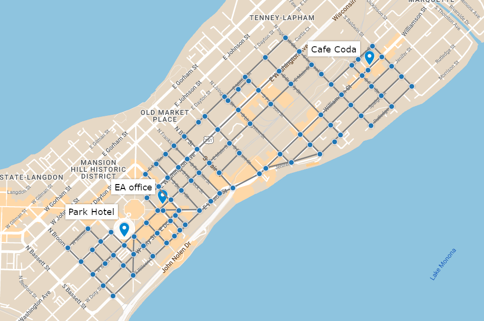
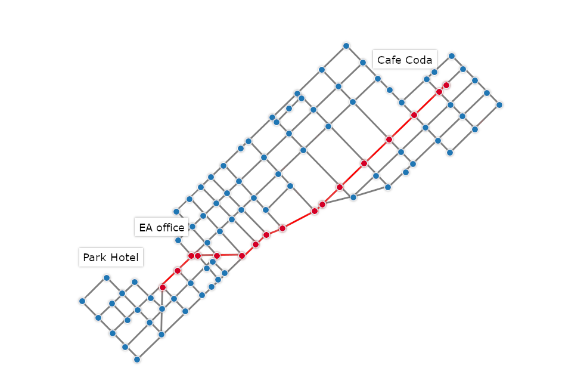
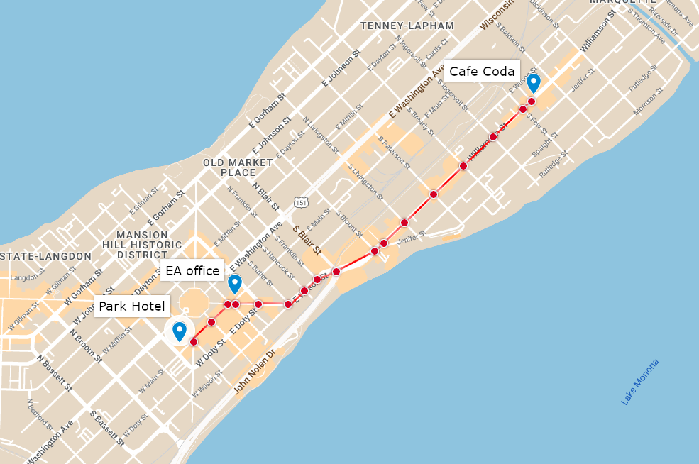

[comment]: # (controls: true)
[comment]: # (keyboard: true)
[comment]: # (markdown: { smartypants: true })
[comment]: # (hash: false)
[comment]: # (respondToHashChanges: false)


<div style="font-family:serif;">Graph Theory & Practice</div>

<hr style="border-width:1px 0 0 0; border-color:rgba(0,0,0,0.1);" />

<div style="font-size:24px; line-height:56px;"><strong>Tom Reitz</strong> &nbsp; | &nbsp; data engineer @ </div>

[comment]: # (!!! data-background-video="media/graph-bg.mp4", data-background-video-loop data-background-video-muted data-background-opacity="0.1")


<!-- <div style="font-family:serif;">Goals</div> -->

<!-- <hr style="border-width:1px 0 0 0; border-color:rgba(0,0,0,0.1);" /> -->

<!-- * understand Graphs <!-- .element: class="fragment" data-fragment-index="1" -->
<!-- * 10 minutes! <!-- .element: class="fragment" data-fragment-index="2" -->
<!-- * 52 slides (5.2 slides / min) <!-- .element: class="fragment" data-fragment-index="3" -->

<!-- [comment]: # (!!! data-auto-animate data-background-video="media/graph-bg.mp4", data-background-video-loop data-background-video-muted data-background-opacity="0.03") -->


<div style="font-family:serif;">Definitions</div>

<hr style="border-width:1px 0 0 0; border-color:rgba(0,0,0,0.1);" />

 <!-- .element: style="height:30vh; max-width:50vw; image-rendering: crisp-edges;" -->

<span><u>not</u> Graph.</span>
<span>(Plot, Chart)</span>

[comment]: # (!!! data-auto-animate data-background-video="media/graph-bg.mp4", data-background-video-loop data-background-video-muted data-background-opacity="0.1")


<div style="font-family:serif;">Definitions</div>

<hr style="border-width:1px 0 0 0; border-color:rgba(0,0,0,0.1);" />

 <!-- .element: style="height:30vh; max-width:50vw; image-rendering: crisp-edges;" -->

 <span><em>Vertices</em> $V$ (nodes)</span>


[comment]: # (||| data-auto-animate data-background-video="media/graph-bg.mp4", data-background-video-loop data-background-video-muted data-background-opacity="0.1")


<div style="font-family:serif;">Definitions</div>

<hr style="border-width:1px 0 0 0; border-color:rgba(0,0,0,0.1);" />

 <!-- .element: style="height:30vh; max-width:50vw; image-rendering: crisp-edges;" -->

\+ <em>Edges</em> $E$ (links)


[comment]: # (||| data-auto-animate data-background-video="media/graph-bg.mp4", data-background-video-loop data-background-video-muted data-background-opacity="0.1")


<div style="font-family:serif;">Definitions</div>

<hr style="border-width:1px 0 0 0; border-color:rgba(0,0,0,0.1);" />

 <!-- .element: style="height:30vh; max-width:50vw; image-rendering: crisp-edges;" -->

= Graph $G$


[comment]: # (||| data-auto-animate data-background-video="media/graph-bg.mp4", data-background-video-loop data-background-video-muted data-background-opacity="0.1")


<div style="font-family:serif;">Definitions</div>

<hr style="border-width:1px 0 0 0; border-color:rgba(0,0,0,0.1);" />

 <!-- .element: style="height:30vh; max-width:50vw; image-rendering: crisp-edges;" -->

$|V| =$ <em>order</em> of $G$ (7)

$|E| =$ <em>size</em> of $G$ (7)


[comment]: # (||| data-auto-animate data-background-video="media/graph-bg.mp4", data-background-video-loop data-background-video-muted data-background-opacity="0.1")


<div style="font-family:serif;">Definitions</div>

<hr style="border-width:1px 0 0 0; border-color:rgba(0,0,0,0.1);" />

 <!-- .element: style="height:30vh; max-width:50vw; image-rendering: crisp-edges;" -->

<em>degree</em> of vertex $v$ = # <em>incident edges</em> (5)


[comment]: # (||| data-auto-animate data-background-video="media/graph-bg.mp4", data-background-video-loop data-background-video-muted data-background-opacity="0.1")


<div style="font-family:serif;">Definitions</div>

<hr style="border-width:1px 0 0 0; border-color:rgba(0,0,0,0.1);" />

 <!-- .element: style="height:30vh; max-width:50vw; image-rendering: crisp-edges;" -->

$f, g$ = <em>adjacent vertices</em>


[comment]: # (||| data-auto-animate data-background-video="media/graph-bg.mp4", data-background-video-loop data-background-video-muted data-background-opacity="0.1")


<div style="font-family:serif;">Definitions</div>

<hr style="border-width:1px 0 0 0; border-color:rgba(0,0,0,0.1);" />

 <!-- .element: style="height:30vh; max-width:50vw; image-rendering: crisp-edges;" -->

<em>path</em>


[comment]: # (||| data-auto-animate data-background-video="media/graph-bg.mp4", data-background-video-loop data-background-video-muted data-background-opacity="0.1")


<div style="font-family:serif;">Definitions</div>

<hr style="border-width:1px 0 0 0; border-color:rgba(0,0,0,0.1);" />

 <!-- .element: style="height:30vh; max-width:50vw; image-rendering: crisp-edges;" -->

<em>Directed</em> graph


[comment]: # (||| data-auto-animate data-background-video="media/graph-bg.mp4", data-background-video-loop data-background-video-muted data-background-opacity="0.1")


<div style="font-family:serif;">Definitions</div>

<hr style="border-width:1px 0 0 0; border-color:rgba(0,0,0,0.1);" />

 <!-- .element: style="height:30vh; max-width:50vw; image-rendering: crisp-edges;" -->

<em>Cycle</em> in a directed graph


[comment]: # (||| data-auto-animate data-background-video="media/graph-bg.mp4", data-background-video-loop data-background-video-muted data-background-opacity="0.1")


<div style="font-family:serif;">Definitions</div>

<hr style="border-width:1px 0 0 0; border-color:rgba(0,0,0,0.1);" />

 <!-- .element: style="height:30vh; max-width:50vw; image-rendering: crisp-edges;" -->

<em>Weighted</em> graph


[comment]: # (||| data-auto-animate data-background-video="media/graph-bg.mp4", data-background-video-loop data-background-video-muted data-background-opacity="0.1")


<div style="font-family:serif;">Definitions</div>

<hr style="border-width:1px 0 0 0; border-color:rgba(0,0,0,0.1);" />

 <!-- .element: style="height:30vh; max-width:50vw; image-rendering: crisp-edges;" -->

<em>Tree</em>

<small>single path between every two vertices... $|E| = |V| - 1$ </small>


[comment]: # (||| data-auto-animate data-background-video="media/graph-bg.mp4", data-background-video-loop data-background-video-muted data-background-opacity="0.1")


<div style="font-family:serif;">Definitions</div>

<hr style="border-width:1px 0 0 0; border-color:rgba(0,0,0,0.1);" />

 <!-- .element: style="height:30vh; max-width:50vw; image-rendering: crisp-edges;" -->

<em>Bipartite</em> graph

<small>vertices separable into two unconnected sets</small>


[comment]: # (||| data-auto-animate data-background-video="media/graph-bg.mp4", data-background-video-loop data-background-video-muted data-background-opacity="0.1")


<div style="font-family:serif;">Definitions</div>

<hr style="border-width:1px 0 0 0; border-color:rgba(0,0,0,0.1);" />

 <!-- .element: style="height:20vh; max-width:50vw; image-rendering: crisp-edges;" -->

<em>Complete</em> graph<br />

<small>$E = {{ V \cdot (V-1) } \over 2} = O(V^2)$</small>


[comment]: # (!!! data-auto-animate data-background-video="media/graph-bg.mp4", data-background-video-loop data-background-video-muted data-background-opacity="0.1")


<div style="font-family:serif;">Storage</div>

<hr style="border-width:1px 0 0 0; border-color:rgba(0,0,0,0.1);" />

<div style="display:inline-block; width:50%; float:left;">

</div>
<div style="display:inline-block; width:50%;">

```yaml
a: [b]
b: [a, c, d, e, f]
c: [b]
d: [b, f]
e: [b]
f: [b, d, g]
g: [f]
```

</div>
<div style="clear:both;"></div>

adjacency <em>list</em>

[comment]: # (||| data-auto-animate data-background-video="media/graph-bg.mp4", data-background-video-loop data-background-video-muted data-background-opacity="0.1")


<div style="font-family:serif;">Storage</div>

<hr style="border-width:1px 0 0 0; border-color:rgba(0,0,0,0.1);" />

<div style="display:inline-block; width:50%; float:left;">

</div>
<div style="display:inline-block; width:50%;">

<div style="font-size:50%; background-color:#FFF;">

`$$\begin{array} {r|r|r|r|r|r|r|r|} & a & b & c & d & e & f & g \\
\hline a & - & 1 & - & - & - & - & - \\
\hline b & 1 & - & 1 & 1 & 1 & 1 & - \\
\hline c & - & 1 & - & - & - & - & - \\
\hline d & - & 1 & - & - & - & 1 & - \\
\hline e & - & 1 & - & - & - & - & - \\
\hline f & - & 1 & - & 1 & - & - & 1 \\
\hline g & - & - & - & - & - & 1 & - \\
\hline  \end{array}$$`

</div>

</div>
<br style="clear:both;">

adjacency <em>matrix</em><br />
<small>(symmetric if undirected)</small>

[comment]: # (!!! data-auto-animate data-background-video="media/graph-bg.mp4", data-background-video-loop data-background-video-muted data-background-opacity="0.1")


<div style="font-family:serif;">Representation</div>

<hr style="border-width:1px 0 0 0; border-color:rgba(0,0,0,0.1);" />

<div style="display:inline-block; width:50%; float:left;">

```dot
digraph graphname {
  a -> b -> c;
  b -> d;
}
```

</div>
<div style="display:inline-block; width:50%;">

</div>

[DOT](https://graphviz.org/doc/info/lang.html)

[comment]: # (||| data-auto-animate data-background-video="media/graph-bg.mp4", data-background-video-loop data-background-video-muted data-background-opacity="0.1")


<div style="font-family:serif;">Representation</div>

<hr style="border-width:1px 0 0 0; border-color:rgba(0,0,0,0.1);" />

<div style="font-size:70%">

```xml
<?xml version="1.0" encoding="UTF-8"?>
<graphml xmlns="http://graphml.graphdrawing.org/xmlns"
	xmlns:xsi="http://www.w3.org/2001/XMLSchema-instance"
	xsi:schemaLocation="http://graphml.graphdrawing.org/xmlns/1.0/graphml.xsd">
	<graph id="G" edgedefault="undirected">
		<node id="n0"/>
		<node id="n1"/>
		<edge id="e1" source="n0" target="n1"/>
	</graph>
</graphml>
```

</div>

[GraphML](https://en.wikipedia.org/wiki/GraphML)

[comment]: # (||| data-auto-animate data-background-video="media/graph-bg.mp4", data-background-video-loop data-background-video-muted data-background-opacity="0.1")


<div style="font-family:serif;">Other Representations</div>

<hr style="border-width:1px 0 0 0; border-color:rgba(0,0,0,0.1);" />

* [GML](https://en.wikipedia.org/wiki/Graph_Modelling_Language) (graph modelling language)
* [DGML](https://en.wikipedia.org/wiki/DGML) (directed graph markup language)

[comment]: # (!!! data-auto-animate data-background-video="media/graph-bg.mp4", data-background-video-loop data-background-video-muted data-background-opacity="0.1")


<div style="font-family:serif;">Algorithms</div>

<hr style="border-width:1px 0 0 0; border-color:rgba(0,0,0,0.1);" />

<div style="display:inline-block; width:65%; float:left;">

* Search
	- [Breadth-First Search](https://en.wikipedia.org/wiki/Breadth-first_search) (BFS)
		- [implemented](https://www.geeksforgeeks.org/breadth-first-search-or-bfs-for-a-graph/) using a queue
	- [Depth-First Search](https://en.wikipedia.org/wiki/Depth-first_search) (DFS)
		- [implemented](https://www.geeksforgeeks.org/depth-first-search-or-dfs-for-a-graph/) with recursion
	- both $\approx O(V + E)$

</div>
<div style="display:inline-block; width:35%;">


</div>

[comment]: # (||| data-auto-animate data-background-video="media/graph-bg.mp4", data-background-video-loop data-background-video-muted data-background-opacity="0.1")


<div style="font-family:serif;">Algorithms</div>

<hr style="border-width:1px 0 0 0; border-color:rgba(0,0,0,0.1);" />

<div style="display:inline-block; width:65%; float:left;">

* [Cycle detection](https://en.wikipedia.org/wiki/Cycle_(graph_theory)#Cycle_detection) in directed graphs
	- $\approx O(V + E)$

</div>
<div style="display:inline-block; width:35%;">

</div>
<div style="margin-top:-60px;">

* [Shortest path](https://en.wikipedia.org/wiki/Shortest_path_problem)
	- directed vs. undirected
	- weighted vs. unweighted
	- [Dijkstra](https://www.geeksforgeeks.org/dijkstras-shortest-path-algorithm-using-priority_queue-stl/), [Johnson](https://www.geeksforgeeks.org/johnsons-algorithm-for-all-pairs-shortest-paths-implementation/), [Bellman-Ford](https://www.geeksforgeeks.org/bellman-ford-algorithm-dp-23/) algorithms
	- performance from $O(E \cdot V)$ to $O(V ^ 2)$ or better

</div>

[comment]: # (||| data-auto-animate data-background-video="media/graph-bg.mp4", data-background-video-loop data-background-video-muted data-background-opacity="0.1")


<div style="font-family:serif;">Algorithms</div>

<hr style="border-width:1px 0 0 0; border-color:rgba(0,0,0,0.1);" />

<div style="display:inline-block; width:65%; float:left;">

* [Minimum Spanning Tree](https://en.wikipedia.org/wiki/Minimum_spanning_tree)
	- [Prim's algorithm](https://www.geeksforgeeks.org/prims-minimum-spanning-tree-mst-greedy-algo-5/) $\approx O(V^2)$
	- [Kruskal's algorithm](https://www.geeksforgeeks.org/kruskals-algorithm-in-python/) $\approx O(E \cdot log V)$
* [Topological Sorting](https://en.wikipedia.org/wiki/Topological_sorting)
	- [implemented](https://www.geeksforgeeks.org/topological-sorting/) using DFS
	- $\approx O(V + E)$

</div>
<div style="display:inline-block; width:35%;">

</div>

[comment]: # (||| data-auto-animate data-background-video="media/graph-bg.mp4", data-background-video-loop data-background-video-muted data-background-opacity="0.1")

<div style="font-family:serif;">Other Algorithms</div>

<hr style="border-width:1px 0 0 0; border-color:rgba(0,0,0,0.1);" />

* [Connected components](https://en.wikipedia.org/wiki/Component_(graph_theory)) (search)
* Max-flow / min-cut ([Ford-Fulkerson](https://www.geeksforgeeks.org/ford-fulkerson-algorithm-for-maximum-flow-problem/) algorithm)

[comment]: # (!!! data-auto-animate data-background-video="media/graph-bg.mp4", data-background-video-loop data-background-video-muted data-background-opacity="0.1")


<div style="font-family:serif;">Examples</div>

<hr style="border-width:1px 0 0 0; border-color:rgba(0,0,0,0.1);" />


<div style="display:inline-block; width:40%; float:left;">

<div style="font-size:50%; background-color:#FFF;">

* <b>DAGs!</b>
* model task- or data-dependencies
* executed in topological order
* DAGre layout
* <em>top</em>: Airflow task DAG
* <em>right</em>: earthmover transformation DAG
* <em>next slide</em>: dbt transformation DAG

</div>

</div>

<div style="display:inline-block; width:60%;">

</div>

[comment]: # (||| data-auto-animate data-background-video="media/graph-bg.mp4", data-background-video-loop data-background-video-muted data-background-opacity="0.1")


<div style="font-family:serif;">Examples</div>

<hr style="border-width:1px 0 0 0; border-color:rgba(0,0,0,0.1);" />


<small>dbt transformation DAG</small>

[comment]: # (||| data-auto-animate data-background-video="media/graph-bg.mp4", data-background-video-loop data-background-video-muted data-background-opacity="0.1")


<div style="font-family:serif;">Examples</div>

<hr style="border-width:1px 0 0 0; border-color:rgba(0,0,0,0.1);" />

 <!-- .element: style="height:40vh; max-width:80vw; image-rendering: crisp-edges;" -->

<small>Map directions?</small>

[comment]: # (||| data-auto-animate data-background-video="media/graph-bg.mp4", data-background-video-loop data-background-video-muted data-background-opacity="0.1")


<div style="font-family:serif;">Examples</div>

<hr style="border-width:1px 0 0 0; border-color:rgba(0,0,0,0.1);" />

 <!-- .element: style="height:40vh; max-width:80vw; image-rendering: crisp-edges;" -->

<small>Intersections as nodes...</small>

[comment]: # (||| data-auto-animate data-background-video="media/graph-bg.mp4", data-background-video-loop data-background-video-muted data-background-opacity="0.1")


<div style="font-family:serif;">Examples</div>

<hr style="border-width:1px 0 0 0; border-color:rgba(0,0,0,0.1);" />

 <!-- .element: style="height:40vh; max-width:80vw; image-rendering: crisp-edges;" -->

<small>Roads as links... (weighted by speed limit, traffic)</small>

[comment]: # (||| data-auto-animate data-background-video="media/graph-bg.mp4", data-background-video-loop data-background-video-muted data-background-opacity="0.1")


<div style="font-family:serif;">Examples</div>

<hr style="border-width:1px 0 0 0; border-color:rgba(0,0,0,0.1);" />

 <!-- .element: style="height:40vh; max-width:80vw; image-rendering: crisp-edges;" -->

<small>Path-finding!</small>

[comment]: # (||| data-auto-animate data-background-video="media/graph-bg.mp4", data-background-video-loop data-background-video-muted data-background-opacity="0.1")


<div style="font-family:serif;">Examples</div>

<hr style="border-width:1px 0 0 0; border-color:rgba(0,0,0,0.1);" />

 <!-- .element: style="height:40vh; max-width:80vw; image-rendering: crisp-edges;" -->

<small>(solved)</small>

[comment]: # (||| data-auto-animate data-background-video="media/graph-bg.mp4", data-background-video-loop data-background-video-muted data-background-opacity="0.1")


<div style="font-family:serif;">Examples</div>

<hr style="border-width:1px 0 0 0; border-color:rgba(0,0,0,0.1);" />

<div style="display:inline-block; width:30%; margin-top:20vh; float:left;">

<div style="font-size:50%; background-color:#FFF;">

* meetings at EA
* from Outlook calendar data
* directed, acyclic graph with radial arc visualization

</div>

</div>

<div style="display:inline-block; width:70%; background-color:#FFF;">

</div>

[comment]: # (||| data-auto-animate data-background-video="media/graph-bg.mp4", data-background-video-loop data-background-video-muted data-background-opacity="0.1")


<div style="font-family:serif;">Examples</div>

<hr style="border-width:1px 0 0 0; border-color:rgba(0,0,0,0.1);" />

<div style="display:inline-block; width:30%; margin-top:20vh; float:left;">

<div style="font-size:50%; background-color:#FFF;">

* meetings at EA (Tom's)
* from Outlook calendar data
* directed, acyclic graph with radial arc visualization

</div>

</div>

<div style="display:inline-block; width:70%; background-color:#FFF;">

</div>

[comment]: # (||| data-auto-animate data-background-video="media/graph-bg.mp4", data-background-video-loop data-background-video-muted data-background-opacity="0.1")


<div style="font-family:serif;">Examples</div>

<hr style="border-width:1px 0 0 0; border-color:rgba(0,0,0,0.1);" />

<div style="display:inline-block; width:30%; margin-top:20vh; float:left;">

<div style="font-size:50%; background-color:#FFF;">

* financial flow (thousands of $)
* based on public data such as [EA 2023 IRS documents](https://projects.propublica.org/nonprofits/organizations/461580391)
* weighted, directed, acyclic graph with Sankey visualization

</div>

</div>

<div style="display:inline-block; width:70%;">

</div>

[comment]: # (||| data-auto-animate data-background-video="media/graph-bg.mp4", data-background-video-loop data-background-video-muted data-background-opacity="0.1")


<div style="font-family:serif;">Examples</div>

<hr style="border-width:1px 0 0 0; border-color:rgba(0,0,0,0.1);" />

<div style="display:inline-block; width:60%; float:left; font-size:50%; background-color:#FFF;">


* (part of the) Ed-Fi data model
* nodes = Resources
* links = References

</div>

<div style="display:inline-block; width:40%; font-size:50%; background-color:#FFF;">


* (part of the) EDU data model
* nodes = dims
* links = facts, foreign keys (`k_*`)

</div>

[comment]: # (||| data-auto-animate data-background-video="media/graph-bg.mp4", data-background-video-loop data-background-video-muted data-background-opacity="0.1")


<div style="font-family:serif;">Other Examples</div>

<hr style="border-width:1px 0 0 0; border-color:rgba(0,0,0,0.1);" />

* [Seven Bridges of Königsberg](https://en.wikipedia.org/wiki/Seven_Bridges_of_K%C3%B6nigsberg)
* [Graph coloring](https://en.wikipedia.org/wiki/Graph_coloring) and the [four color theorem](https://en.wikipedia.org/wiki/Four_color_theorem)
* [Stable Matching problem](https://en.wikipedia.org/wiki/Stable_marriage_problem) and the [max-flow, min-cut theorem](https://en.wikipedia.org/wiki/Max-flow_min-cut_theorem)
* [Traveling Salesman problem](https://en.wikipedia.org/wiki/Travelling_salesman_problem#Exact_algorithms)
* [Erdős number](https://en.wikipedia.org/wiki/Erd%C5%91s_number) and collaboration distance

[comment]: # (!!! data-auto-animate data-background-video="media/graph-bg.mp4", data-background-video-loop data-background-video-muted data-background-opacity="0.1")


<div style="font-family:serif;">Data as a graph</div>

<hr style="border-width:1px 0 0 0; border-color:rgba(0,0,0,0.1);" />

<small>Suppose we want to find students who are in a class together...</small>


<small>(paths of length 2 in a graph like above)</small>

[comment]: # (||| data-auto-animate data-background-video="media/graph-bg.mp4", data-background-video-loop data-background-video-muted data-background-opacity="0.1")


<div style="font-family:serif;">Data as a graph</div>

<hr style="border-width:1px 0 0 0; border-color:rgba(0,0,0,0.1);" />

<div style="font-size:50%">

`$$C = \begin{array} {r|r|r|r|r|r|r|r|} & Algebra I & US History & ... \\
\hline Alice & 1 & - & \dots \\
\hline Billy & 1 & - & \dots \\
\hline Cassidy & 1 & 1 & \dots \\
\hline Danni & 1 & 1 & \dots \\
\hline Erika & - & 1 & \dots \\
\hline Felly & - & 1 & \dots \\
\hline \vdots & \vdots & \vdots & \vdots \\
\hline  \end{array}$$`

</div>

<small>adjacency matrix $C$</small>


[comment]: # (||| data-auto-animate data-background-video="media/graph-bg.mp4", data-background-video-loop data-background-video-muted data-background-opacity="0.1")

<div style="font-family:serif;">Data as a graph</div>

<hr style="border-width:1px 0 0 0; border-color:rgba(0,0,0,0.1);" />

<div style="font-size:50%">

`$$C \cdot C^{T} = \begin{array} {r|r|r|r|r|r|r|r|} & Alice & Billy & Cassidy & Danni & Erika & Felly & ... \\
\hline Alice & 1 & 1 & 1 & 1 & - & - & \dots \\
\hline Billy & 1 & 1 & 1 & 1 & - & - & \dots \\
\hline Cassidy & 1 & 1 & 2 & 2 & 1 & 1 & \dots \\
\hline Danni & 1 & 1 & 2 & 2 & 1 & 1 & \dots \\
\hline Erika & - & - & 1 & 1 & 1 & 1 & \dots \\
\hline Felly & - & - & 1 & 1 & 1 & 1 & \dots \\
\hline \vdots & \vdots & \vdots & \vdots & \vdots & \vdots & \vdots & \vdots \\
\hline  \end{array}$$`

</div>

<small>adjacency matrix multiplication</small>


[comment]: # (||| data-auto-animate data-background-video="media/graph-bg.mp4", data-background-video-loop data-background-video-muted data-background-opacity="0.1")

<div style="font-family:serif;">Data as a graph</div>

<hr style="border-width:1px 0 0 0; border-color:rgba(0,0,0,0.1);" />

<div style="font-size:50%">

```sql
select
	ssa1.k_student,
	ssa2.k_student,
    count(*)
from analytics.prod_wh.fct_student_section_association ssa1
join analytics.prod_wh.fct_student_section_association ssa2
	on ssa1.k_course_section = ssa2.k_course_section
group by 1,2
```

| k_student | k_student | count(*) |
|---|---|---|
|6d0cee02104b5081a3bf2ccf6aba41bc|03b9b001da4a3aaa35af708606d6a215|2|
|958f2878bf9e09742cf78680eda2aea5|03b9b001da4a3aaa35af708606d6a215|4|
|724aba25d88a215cec59ff953bdc3dac|03b9b001da4a3aaa35af708606d6a215|2|
|35b20a781761b44053407ad274c46fa5|03b9b001da4a3aaa35af708606d6a215|1|
|...|...|...|

</div>

<small>join</small>

[comment]: # (||| data-auto-animate data-background-video="media/graph-bg.mp4", data-background-video-loop data-background-video-muted data-background-opacity="0.1")


<div style="font-family:serif;">Data as a graph</div>

<hr style="border-width:1px 0 0 0; border-color:rgba(0,0,0,0.1);" />


<small>Analog between graph search, matrix multiplication, and database table join!</small>

[comment]: # (!!! data-auto-animate data-background-video="media/graph-bg.mp4", data-background-video-loop data-background-video-muted data-background-opacity="0.1")


<div style="font-family:serif;">Graph Viz Layouts</div>

<hr style="border-width:1px 0 0 0; border-color:rgba(0,0,0,0.1);" />

<div style="font-size:40%">

<table>
	<tbody>
		<tr>
			<td style="width:25%"><a href="https://observablehq.com/@d3/force-directed-graph-component"></a></td>
			<td style="width:25%"><a href="https://www.jroehm.com/2014/10/29/social-network-vizualiation/"></a></td>
			<td style="width:25%"><a href="https://observablehq.com/@d3/hierarchical-edge-bundling"></a></td>
			<td style="width:25%"><a href="https://deeppavlov.ai/research/tpost/bn15u1y4v1-improving-knowledge-graph-completion-wit"></a></td>
		</tr>
		<tr>
			<td style="text-align:center">Force-directed</td>
			<td style="text-align:center">Clustered</td>
			<td style="text-align:center">Edge bundling</td>
			<td style="text-align:center">Knowledge graph</td>
		</tr>
		<tr>
			<td><a href="https://d3-graph-gallery.com/arc.html"></a></td>
			<td><a href="https://observablehq.com/@d3/sankey-component"></a></td>
			<td><a href="https://github.com/edanalytics/dtml_editor#getting-started"></a></td>
			<td><a href="https://github.com/edanalytics/earthmover/network"></a></td>
		</tr>
		<tr>
			<td style="text-align:center">Arc</td>
			<td style="text-align:center">Sankey</td>
			<td style="text-align:center">DAGre</td>
			<td style="text-align:center">Git network</td>
		</tr>
	</tbody>
</table><br />
(<a href="https://medium.com/towards-data-science/large-graph-visualization-tools-and-approaches-2b8758a1cd59">Towards Data Science article</a> about large graph viz)
</div>

[comment]: # (||| data-auto-animate data-background-video="media/graph-bg.mp4", data-background-video-loop data-background-video-muted data-background-opacity="0.1")


<div style="font-family:serif;">Software Libraries</div>

<hr style="border-width:1px 0 0 0; border-color:rgba(0,0,0,0.1);" />

<div style="font-size:60%">
<table>
	<thead>
		<tr>
			<td>Language</td>
			<td>Library</td>
			<td>Notes</td>
		</tr>
	</thead>
	<tbody>
		<tr>
			<td rowspan=2>Python</td>
			<td><a href="https://networkx.org/">NetworkX</a></td>
			<td></td>
		</tr>
		<tr>
			<td><a href="https://pygraphviz.github.io/">PyGraphViz</a></td>
			<td>(Viz)</td>
		</tr>
		<tr>
			<td>Rust</td>
			<td><a href="https://www.rustworkx.org/">rustworkx</a></td>
			<td></td>
		</tr>
		<tr>
			<td rowspan=3>Javascript</td>
			<td><a href="https://js.cytoscape.org/">Cytoscape.js</a></td>
			<td></td>
		</tr>
		<tr>
			<td><a href="https://d3js.org/">D3.js</a></td>
			<td>(Viz)</td>
		</tr>
		<tr>
			<td><a href="https://reactflow.dev/">React Flow</a></td>
			<td>(UI)</td>
		</tr>
		<tr>
			<td>C/C++</td>
			<td><a href="https://igraph.org/c/">igraph</a></td>
			<td></td>
		</tr>
	</tbody>
</table>
</div>

[comment]: # (!!! data-auto-animate data-background-video="media/graph-bg.mp4", data-background-video-loop data-background-video-muted data-background-opacity="0.1")


### Thank you! Questions?

 <!-- .element: style="height:40vh; max-width:40vw; image-rendering: crisp-edges;" -->

(slides)

[comment]: # (!!! data-auto-animate data-background-video="media/graph-bg.mp4", data-background-video-loop data-background-video-muted data-background-opacity="0.1")
